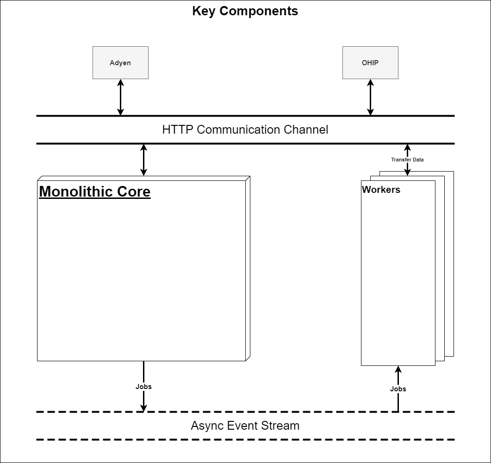

# Introduction

The Pay By Link (PBL) platform integrates the Adyen PBL feature with the Oracle OHIP.

The goal of this document is to provide a system overview and to outline possible deployment blueprint with applicable
samples.

# Architecture overview

This section provides a short architectural overview that focuses on the components of the system and the physical
architectural
view aiding the deployment process.

## Key Components

The following diagram outlines the key components.

**The Monolithic core** represents the main part of the system. It handles interaction with an end-user, handles
various configurations, receives notifications, and creates jobs for workers to process.

**Workers** on the other hand process payment notifications in the background. They serve as consumers for notification
jobs produced by the Core. They can be horizontally scaled as necessary, meaning that multiple workers can be running at
the same time to increase the number of notifications that can be processed in parallel.

The Core and workers rely on the Postgres database and AWS SQS-compatible queue to operate. By default, the database
instance is shared, but with data-level replication, they can utilize independent databases if necessary.

# System requirements

Windows or Linux-based (x86-64) system with 2vCPU and 4GBs of RAM at the very minimum. Higher loads might necessitate a
more capable server and scaling strategies.

# Deployment guide

The section that follows covers the prototypical deployment approach using Docker. Feel free to adapt it to your
environment and
specific
context.

## Images overview (Docker)

The system consists of two main docker images:

* App docker image (used to deploy main applicative container)
* Workers docker image (used to deploy background workers container(s))

### License

By passing the value "Y" to the environment variable "ACCEPT_LICENSE", you are expressing that you accept
the [license](LICENSE).

### [App docker image](https://gallery.ecr.aws/f8h5l8q1/adyen/hospitality/api)

This image encapsulates the main applicative component of the system. Containers based on this image must be exposed to
the internet either through a reverse proxy or through a load balancer.

The main applicative component of the system serves API and user interface, additionally, it provides connectivity with
Adyen and OHIP.

#### Configuration overview

The environment configuration for the application is handled by setting appropriate configuration values in the "
appsettings.App.json" file. The example of the file is provided in
the [assets directory](assets/docker/app/appsettings.App.json). The following table provides explanation of the values
present in the configuration file:

| Key                                     | Value                                                                                                                                        | Description                                                                                                                                                                       |
|-----------------------------------------|----------------------------------------------------------------------------------------------------------------------------------------------|-----------------------------------------------------------------------------------------------------------------------------------------------------------------------------------|
| Logging__LogLevel__Default              | Information                                                                                                                                  |                                                                                                                                                                                   |
| Logging__LogLevel__Microsoft.AspNetCore | Warning                                                                                                                                      |                                                                                                                                                                                   |
| NLog__targets__file                     | {'type': 'File', 'fileName': 'logs/${shortdate}.log', 'layout': '${longdate} ${uppercase:${level}} ${message} ${exception:format=ToString}'} | For more details please check the official nlog [docs](https://nlog-project.org/).                                                                                                |
| NLog__rules                             | [{'logger': '*', 'minLevel': 'Information', 'writeTo': 'file'}]                                                                              |                                                                                                                                                                                   |
| ConnectionStrings__AdyenPlatform        | Server=systemdb;Port=5432;Database=%{{POSTGRES_DB}}%;UserId=master;Password=%{{POSTGRES_PASSWORD}}%                                          | Postgres database connection string.                                                                                                                                              |
| BaseUrl__Url                            | %{{APP_URL}}%                                                                                                                                | Base application URL (https://my.app.example.com)                                                                                                                                 |
| AWS__ServiceEndpoint                    | http://elasticmq-native:9324                                                                                                                 | Connection details for your AWS SQS compatible queue. [example](https://github.com/softwaremill/elasticmq)                                                                        |
| AWS__QueueUrl                           | http://elasticmq-native:9324/queue/adyen-platform.fifo                                                                                       |                                                                                                                                                                                   |
| AWS__DlQueueUrl                         |                                                                                                                                              |                                                                                                                                                                                   |
| AWS__WorkersNumber                      | 1                                                                                                                                            | Number of parallel workers. Note: these workers share the same process. You can also start workers in separate processes if you start multiple instances of the worker container. |
| EmailOptions__From                      | example@email.com                                                                                                                            | Your email that will be used in the outgoing correspondence.                                                                                                                      |
| Adyen__AuthorizationEndpoint            | https://ca-test.adyen.com/ca/ca/oauth/connect.shtml                                                                                          | Adyen API URL. Do not change without prior notice.                                                                                                                                |
| Adyen__CAUrl                            | https://ca-test.adyen.com/ca/ca/transactions/payment-link-details.shtml?d=                                                                   | Adyen API URL. Do not change without prior notice.                                                                                                                                |
| Adyen__BaseApiUrl                       | https://management-test.adyen.com                                                                                                            | Adyen API URL. Do not change without prior notice.                                                                                                                                |
| Adyen__CheckoutApiUrl                   | https://checkout-test.adyen.com                                                                                                              | Adyen API URL. Do not change without prior notice.                                                                                                                                |
| Adyen__LiveBaseApiUrl                   | https://management-live.adyen.com                                                                                                            | Adyen API URL. Do not change without prior notice.                                                                                                                                |
| Adyen__LiveCheckoutApiUrl               | https://{PREFIX}-checkout-live.adyenpayments.com/checkout                                                                                    | Adyen API URL. Do not change without prior notice.                                                                                                                                |
| Adyen__AppUrl                           | %{{APP_URL}}%/app                                                                                                                            |                                                                                                                                                                                   |
| Adyen__IsCloud                          | False                                                                                                                                        |                                                                                                                                                                                   |
| Adyen__VersionsApiUrl                   | https://zegwzu3gafbydgn6jbjasfdkmi0dzgxc.lambda-url.eu-central-1.on.aws/                                                                     | The URL that provides information about the latest available versions. It should not be changed without prior notice.                                                             |
| FEApp__ApiUrl                           | %{{APP_URL}}%/api/v1                                                                                                                         |                                                                                                                                                                                   |
| FEApp__AppPath                          | /app/                                                                                                                                        |                                                                                                                                                                                   |
| OracleOHIP__AppKey                      | b57a184f-0a96-40fd-b1ae-3dd598eed66a                                                                                                         |                                                                                                                                                                                   |
| OracleOHIP__ClientId                    | adyen_Client                                                                                                                                 |                                                                                                                                                                                   |

#### Logs

You can access applicative logs by mounting the /app/logs directory of the container.

#### Uploaded Files

You should mount /app/files directory to prevent data loss upon container restart, as it contains uploaded files.

### [Workers docker image](https://gallery.ecr.aws/f8h5l8q1/adyen/hospitality/workers)

This docker image defines a background service that processes payment notifications. Containers based upon this image
must
remain in a private subnetwork. Additionally, they can be scaled out as necessary.

#### Configuration overview

The example of the configuration file is provided in
the [assets directory](assets/docker/app/appsettings.Worker.json). The following table provides overview of available
configuration variables.

| Key                                     | Value                                                                                                                                               |
|-----------------------------------------|-----------------------------------------------------------------------------------------------------------------------------------------------------|
| Logging__LogLevel__Default              | Information                                                                                                                                         |
| Logging__LogLevel__Microsoft.AspNetCore | Warning                                                                                                                                             |
| NLog__targets__file                     | {'type': 'File', 'fileName': 'logs/worker_${shortdate}.log', 'layout': '${longdate} ${uppercase:${level}} ${message} ${exception:format=ToString}'} |
| NLog__rules                             | [{'logger': '*', 'minLevel': 'Information', 'writeTo': 'file'}]                                                                                     |
| ConnectionStrings__AdyenPlatform        | Server=systemdb;Port=5432;Database=%{{POSTGRES_DB}}%;UserId=master;Password=%{{POSTGRES_PASSWORD}}%                                                 |
| AWS__ServiceEndpoint                    | http://elasticmq-native:9324                                                                                                                        |
| AWS__QueueUrl                           | http://elasticmq-native:9324/queue/adyen-platform.fifo                                                                                              |
| AWS__DlQueueUrl                         |                                                                                                                                                     |
| AWS__WorkersNumber                      | 1                                                                                                                                                   |
| EmailOptions__From                      | example@email.com                                                                                                                                   |
| Adyen__AuthorizationEndpoint            | https://ca-test.adyen.com/ca/ca/oauth/connect.shtml                                                                                                 |
| Adyen__CAUrl                            | https://ca-test.adyen.com/ca/ca/transactions/payment-link-details.shtml?d=                                                                          |
| Adyen__BaseApiUrl                       | https://management-test.adyen.com                                                                                                                   |
| Adyen__CheckoutApiUrl                   | https://checkout-test.adyen.com                                                                                                                     |
| Adyen__LiveBaseApiUrl                   | https://management-live.adyen.com                                                                                                                   |
| Adyen__LiveCheckoutApiUrl               | https://{PREFIX}-checkout-live.adyenpayments.com/checkout                                                                                           |
| Adyen__AppUrl                           | %{{APP_URL}}%/app                                                                                                                                   |
| Adyen__IsCloud                          | False                                                                                                                                               |
| Adyen__VersionsApiUrl                   | https://zegwzu3gafbydgn6jbjasfdkmi0dzgxc.lambda-url.eu-central-1.on.aws/                                                                            |
| OracleOHIP__AppKey                      | b57a184f-0a96-40fd-b1ae-3dd598eed66a                                                                                                                |
| OracleOHIP__ClientId                    | adyen_Client                                                                                                                                        |

#### Logs

You can access applicative logs by mounting the /app/logs directory of the container.

### [Migrations docker image](https://gallery.ecr.aws/f8h5l8q1/adyen/hospitality/migrations)

A container based on this image executes migrations idempotently and terminates afterward.

#### Configuration overview

This image requires no specific configuration. Only the database connection string should be provided as an argument
when
the container is executed.

## Sample docker assets

The sample docker files are provided in the assets directory. The following table provides an overview of the included
files
sample files:

| File                 | Description                                                                                                        |
|----------------------|--------------------------------------------------------------------------------------------------------------------|
| .env                 | Used to perform initial database bootstrap. Not necessary if the external database instance is used (recommended). |
| appsettings.App.json | Example of the main application configuration.                                                                     |
| custom.conf          | Custom AWS SQS queue configuration.                                                                                |
| docker-compose-*.yml | Sample docker files.                                                                                               |

## Sample setup

The sample docker files provide a blueprint for setting up the application. Please utilize this as a guidance and a
suggested approach. Please, check the applicability of the approach for your particular case. Additionally, it is
recommended to use managed database instances and managed queue instances.

## Sample .nginx reverse proxy

The samples include a docker configuration for a nginx reverse proxy. More information about nginx reverse proxy can be
found in the official [documentation](https://docs.nginx.com/nginx/admin-guide/web-server/reverse-proxy/).

### Sample shell script

The sample shell script included in the examples directory guides you through the setup of the application that utilizes
nginx reverse proxy.
The script will:

* generate appropriate configuration files
* set up the database
* setup the queue
* bootstrap the application and workers
* set up the nginx
* use [let's encrypt](https://letsencrypt.org/) to generate https certificates.

To run this script Linux server with installed docker is required.
Additionally, the DNS domain pointing to the server must be prepared in advance.
The server must have ports 80 and 443 accessible from the public internet.

#### Setting up the application using the sample shell script

Steps:

* Clone the repository
* Navigate to the root directory of the cloned repository
* Execute examples/nginx-proxy-example/setup.sh using bash

# Update procedure

To update the application you have to:

* Execute migrations by running the _migrations_ image.
* Start the application and worker containers with newly released images. (Observe the Docker repository for more
  information.)

## Update notification

You will receive an update notification banner in the application when the new version is released.

# Support

Please consult the [help portal](https://help.adyen.com/en_US).